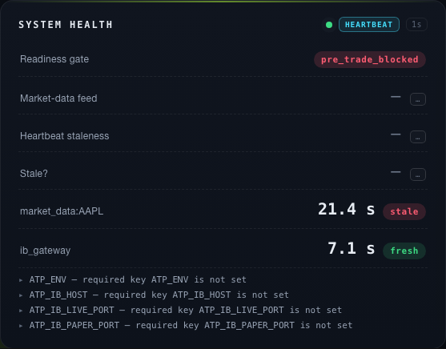

# SRS-MD-003 — verification evidence

> Verify that monitor market data and broker heartbeat freshness continuously.

- **method**: `live-ib`
- **steps evidenced**: 4/4
- **critics**: deterministic `approve`, judgment `block`
- **artifacts**: 1
- **record complete**: NO

## Outstanding

- deterministic critic approved at an unrecorded commit, which cannot be checked against this one (missing, unknown, unreadable, or on another line of history). An unverifiable verdict is not a current one — re-run the deterministic review.
- judgment critic verdict is 'block', not 'approve'
- verification_method is 'live-ib' and 1 image artifact(s) are attached to step 3, but the commit they record cannot be checked against this one (unknown, unreadable, or on another line of history). An unverifiable head is not a fresh one — re-run the step.
- step(s) [1, 2] ran against code that has since moved (234 path(s) changed, e.g. .env.example, .github/workflows/ci.yml, .github/workflows/integration.yml) - re-run them with `tools/evidence.py run SRS-MD-003 --step N -- <command>`
- step(s) [3, 4] record a commit that cannot be checked against this one (missing, unknown, unreadable, or on another line of history); an unverifiable step is not a fresh one

## Acceptance criterion

> Step 3: Verify acceptance criteria: Market data and IB Gateway heartbeat staleness over 15 seconds is detected, logged, displayed, and reflected in system health status.

## Steps

### Step 1

Step 1: Run ./init.sh and confirm the development environment reports Environment ready before verification begins.

`pass` · exit `0` · executed by the tool

```
./init.sh
```

<details><summary>observed output (tail)</summary>

```
→ Installing dependencies...
  Using /Users/joshgenao/Documents/Programming/Python/alphalabs-wt-SRS-MD-003/.venv/bin/python (Python 3.13)
→ Starting dev server...
  A server is already reachable at http://127.0.0.1:3000; using it for smoke tests.
→ Waiting for server...
→ Running baseline smoke test...
→ Running contract checks (scope=env)...
→ contract checks (scope=env, 17 check(s))
  · architecture_check
  · dependency_boundary_check
  · config_check
  · startup_readiness_gate_check
  · startup_readiness_runtime_check
  · ib_adapter_check
  · rest_api_check
  · websocket_api_check
  · cli_check
  · operator_workflow_surface_check
  · operator_interface_runtime_check
  · log_record_check
  · log_persistence_check
  · subscription_fanout_check
  · sim_halt_check
  · strategy_api_indicators_check
  · strategy_api_documentation_check
✓ 17/17 contract check(s) passed (scope=env)
✓ Environment ready
```

</details>

### Step 2

Step 2: Exercise SRS-MD-003 using CLI/API workflows with fixture market data, provider mocks, file reads, and persisted output inspection with the fixtures, mocks, or operator controls needed by the requirement.

`pass` · exit `0` · executed by the tool

```
.venv/bin/python -m pytest tests/unit/test_heartbeat_source.py tests/boundary/test_heartbeat_dashboard_wiring.py tests/test_heartbeat_freshness_contract.py tests/domain/test_heartbeat_staleness.py tests/domain/test_live_heartbeat_feed.py -q
```

<details><summary>observed output (tail)</summary>

```
..................................................................       [100%]
66 passed in 0.94s
```

</details>

### Step 3

Step 3: Verify acceptance criteria: Market data and IB Gateway heartbeat staleness over 15 seconds is detected, logged, displayed, and reflected in system health status.

`pass` · exit `n/a` · hand-recorded (needs attestation)

```
md003_live_feed_cli --snapshot <path> --symbol AAPL --client-id 401 --cadence-ms 7500 --poll-budget-ms 7000 (live IB paper gateway via ssh -L 14002:127.0.0.1:4002); dashboard mounted with ATP_MD003_SNAPSHOT/ATP_MD003_LOG_DIR
```

<details><summary>observed output (tail)</summary>

```
LIVE, 2026-08-14 RTH (10:05-10:21 ET), real IB paper gateway, delayed market data (reqMarketDataType 3), 58 real AAPL ticks observed. DETECTED: market_data:AAPL staleness 21382 ms > 15000 ms threshold, time_stale=true, while ib_gateway stayed fresh at 7088 ms -- per-feed, not blanket. LOGGED: durable JSONL store holds 8 HEARTBEAT_STALE + 9 HEARTBEAT_RECOVERED; sample record event_type=HEARTBEAT_STALE severity=WARN message='market_data:AAPL heartbeat stale (age 21382 ms, threshold 15000 ms)' correlation_id=md003:market_data:AAPL:1786716852563124000. DISPLAYED: dashboard SYSTEM HEALTH panel rendered 'market_data:AAPL 21.4 s [stale]' beside 'ib_gateway 7.1 s [fresh]' (screenshot attached). HEALTH STATUS: GET /dashboard/api/heartbeat any_stale=true, log_write_ok=true, dropped_log_records=0. NOT SHOWN: the staleness arose from delayed-data tick cadence exceeding 15 s, not from a deliberate feed pause; and the panel's summary rows (Market-data feed / Heartbeat staleness / Stale?) still render deferred '-'.
```

</details>



*SYSTEM HEALTH panel, live IB paper session 2026-08-14 RTH: market_data:AAPL 21.4 s STALE (>15 s threshold) while ib_gateway 7.1 s FRESH*


### Step 4

Step 4: Record objective evidence from test, demonstration and leave passes false until the evidence proves the requirement end to end.

`pass` · exit `n/a` · hand-recorded (needs attestation)

```
tools/evidence.py record/artifact/render SRS-MD-003; durable log store at ATP_MD003_LOG_DIR; GET /dashboard/api/heartbeat captured to heartbeat-stale.json
```

<details><summary>observed output (tail)</summary>

```
Objective evidence recorded rather than described: evidence.json carries steps 1-2 executed (exit 0) and steps 3-4 attested from the live window; one image artifact (step3-md003-stale-proof.png, 49 KB) renders inline in EVIDENCE.md; the durable JSONL store holds 17 heartbeat transition records with correlation ids. passes STAYS FALSE until an operator attests -- this step's own instruction.
```

</details>

---

Generated by `tools/evidence.py render`. `passes: true` requires either every step executed by the tool with both critics approving, or a named human attestation — see `AGENTS.md`.
