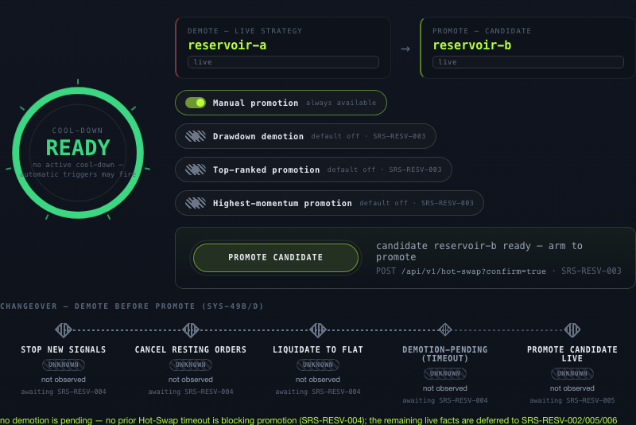
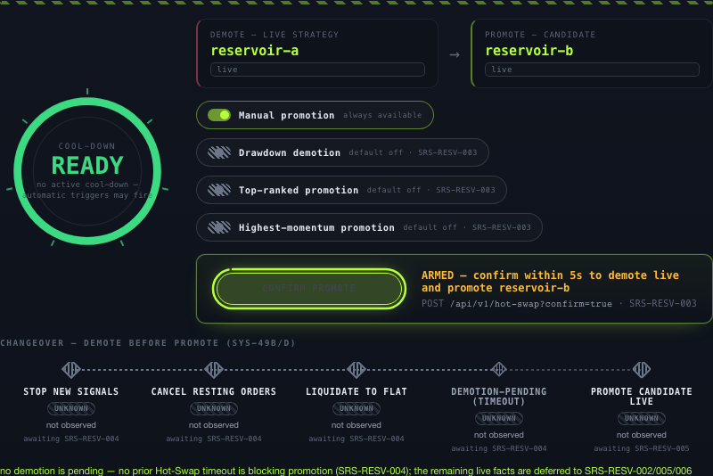
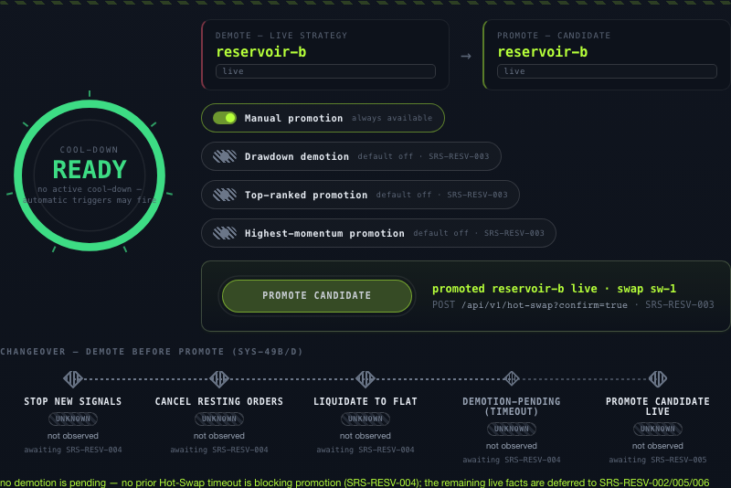
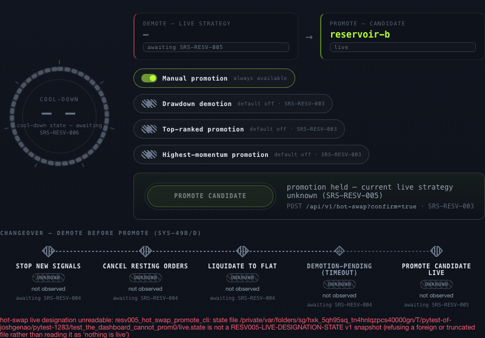

# SRS-RESV-005 — verification evidence

> Verify that promote a selected paper strategy to live execution only after successful demotion.

- **method**: `integration`
- **steps evidenced**: 4/4
- **critics**: deterministic `approve`, judgment `block`
- **artifacts**: 6
- **record complete**: NO

## Outstanding

- deterministic critic approved at an unrecorded commit, which cannot be checked against this one (missing, unknown, unreadable, or on another line of history). An unverifiable verdict is not a current one — re-run the deterministic review.
- judgment critic verdict is 'block', not 'approve'
- step(s) [1, 2, 3, 4] ran against code that has since moved (213 path(s) changed, e.g. .env.example, .github/workflows/ci.yml, .github/workflows/security.yml) - re-run them with `tools/evidence.py run SRS-RESV-005 --step N -- <command>`

## Acceptance criterion

> Step 3: Verify acceptance criteria: The promoted strategy starts live with no open IB positions, preserves prior paper performance history, and uses the same strategy code/API behavior.

## Steps

### Step 1

Step 1: Run ./init.sh and confirm the development environment reports Environment ready before verification begins.

`pass` · exit `0` · executed by the tool

```
./init.sh
```

<details><summary>observed output (tail)</summary>

```
→ Installing dependencies...
  Using /Users/joshgenao/Documents/Programming/Python/alphalabs-wt-SRS-RESV-005/.venv/bin/python (Python 3.13)
→ Starting dev server...
  A server is already reachable at http://127.0.0.1:3010; using it for smoke tests.
→ Waiting for server...
→ Running baseline smoke test...
→ Running contract checks (scope=env)...
→ contract checks (scope=env, 17 check(s))
  · architecture_check
  · dependency_boundary_check
  · config_check
  · startup_readiness_gate_check
  · startup_readiness_runtime_check
  · ib_adapter_check
  · rest_api_check
  · websocket_api_check
  · cli_check
  · operator_workflow_surface_check
  · operator_interface_runtime_check
  · log_record_check
  · log_persistence_check
  · subscription_fanout_check
  · sim_halt_check
  · strategy_api_indicators_check
  · strategy_api_documentation_check
✓ 17/17 contract check(s) passed (scope=env)
✓ Environment ready
```

</details>

### Step 2

Step 2: Exercise SRS-RESV-005 using browser automation against the dashboard plus REST or WebSocket checks where applicable with the fixtures, mocks, or operator controls needed by the requirement.

`pass` · exit `0` · executed by the tool

```
python -m pytest tests/e2e/test_hot_swap_promotion_browser.py -q -p no:randomly
```

<details><summary>observed output (tail)</summary>

```
..                                                                       [100%]
2 passed in 6.26s
```

</details>



*UI-5 Hot-Swap pane before the swap: reservoir-a is live*



*control ARMED — confirm within 5s to demote and promote*



*after the swap: reservoir-b is live, promoted via the dashboard*

🎬 [full session recording](artifacts/step2-page@c6c017d8c362741f51b6335e2ff89686.webm) — 0.3 MB. GitHub does not play video from a repo path; download it, or open the PR's CI artifact.



*unreadable designation: the pane refuses to name a live strategy*

🎬 [full session recording](artifacts/step2-page@657c475363e14b2db3ca78a784fd9720.webm) — 0.3 MB. GitHub does not play video from a repo path; download it, or open the PR's CI artifact.


### Step 3

Step 3: Verify acceptance criteria: The promoted strategy starts live with no open IB positions, preserves prior paper performance history, and uses the same strategy code/API behavior.

`pass` · exit `0` · executed by the tool

```
python -m pytest tests/domain/test_hot_swap_promotion.py -q
```

<details><summary>observed output (tail)</summary>

```
............................                                             [100%]
28 passed in 1.33s
```

</details>

### Step 4

Step 4: Record objective evidence from scenario test and leave passes false until the evidence proves the requirement end to end.

`pass` · exit `0` · executed by the tool

```
python tools/hot_swap_promotion_check.py
```

<details><summary>observed output (tail)</summary>

```
SRS-RESV-005 PASS
- DemotionReceipt: private fields ['demoting_strategy_id', 'candidate_strategy_id', 'elapsed_seconds'], derives neither ['Clone', 'Default'], sole constructor `mint` is pub(crate) and refuses a promotion_allowed:false acceptance
- `execute_hot_swap` is the sole public path: resolve_demotion -> DemotionReceipt::mint -> `promote_after_demotion` (pub(crate), receipt by value)
- `promote_after_demotion`: 14 ordered guards present, exactly one `designate(` write, positions probed before it, drift rolled back after it
- ports ['LivePositionProbe', 'PaperHistorySource', 'HotSwapPromotionEventSink'] are observation-only (no promote/designate/demote method)
- 2 compile_fail doctests: struct-literal forge and `DemotionReceipt::mint` are both proven unreachable from an external crate
- REST: `POST /api/v1/hot-swap` served_by=SRS-RESV-005, closed vocabularies emitted, subprocess budget 90.0s > 60s demotion timeout
- safety-input tier: opt-in at BOTH layers (`--allow-fixture-safety-inputs` before the state read; `fixture_safety_inputs` or a SAFETY_INPUTS_UNAVAILABLE 501 naming ['SRS-EXE-006', 'SRS-ORCH-004'])
- swap serialized: `trigger_config_store::ExclusiveGuard::acquire_creating` bound for the lifetime of the whole load -> execute -> save sequence in cmd_swap
- stale-deferral collector: 8 claim patterns, 9 files, 0 matches
- cargo test -p atp-orchestrator --test resv_5_hot_swap_promotion + --doc: PASS
```

</details>

---

Generated by `tools/evidence.py render`. `passes: true` requires either every step executed by the tool with both critics approving, or a named human attestation — see `AGENTS.md`.
