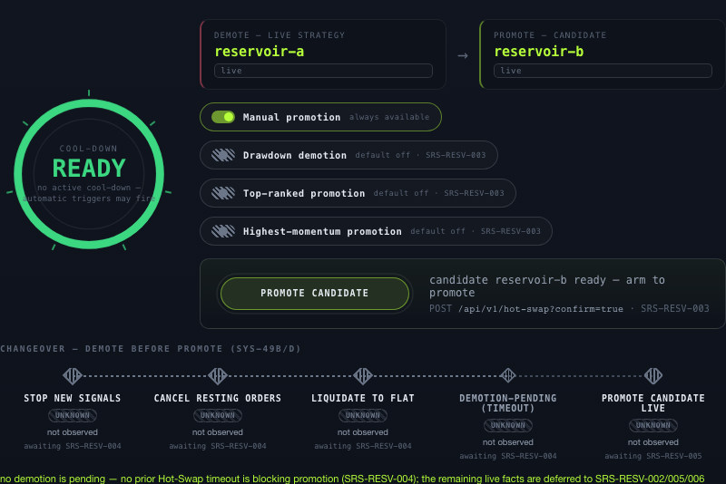
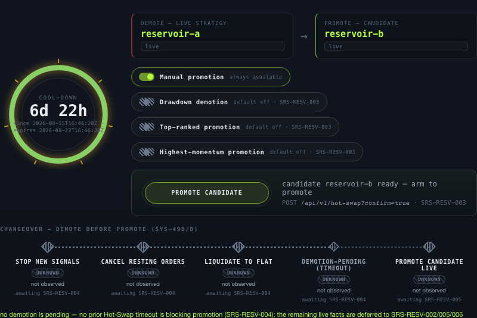
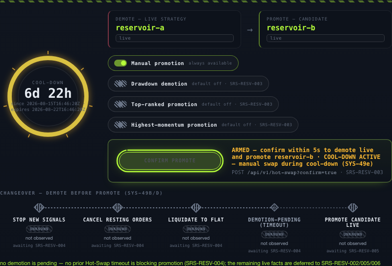
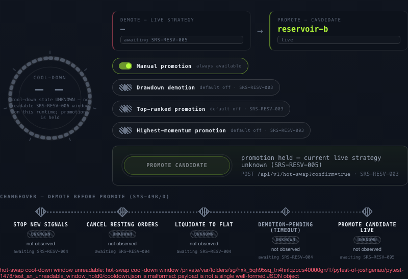
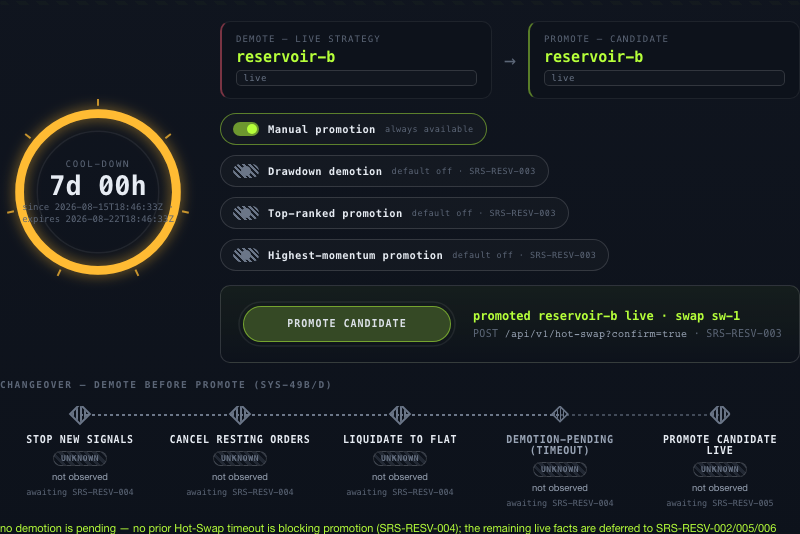

# SRS-RESV-006 — verification evidence

> Verify that enforce Hot-Swap cool-down behavior.

- **method**: `e2e`
- **steps evidenced**: 4/4
- **critics**: deterministic `approve`, judgment `block`
- **artifacts**: 11
- **record complete**: NO

## Outstanding

- deterministic critic approved at 3f0afcf9, but 153 non-evidence path(s) have changed since (.env.example, .github/workflows/security.yml, .gitleaks.toml…) — the approval describes code this close would not ship. Re-run the deterministic review.
- judgment critic verdict is 'block', not 'approve'
- verification_method is 'e2e' and 2 image artifact(s) are attached to step 3, but code has changed since they were captured (.env.example, .github/workflows/security.yml, .gitleaks.toml, SECURITY.md, architecture/README.md …). A screenshot of the previous version cannot certify this one — re-run the step.
- step(s) [1, 2, 3, 4] ran against code that has since moved (153 path(s) changed, e.g. .env.example, .github/workflows/security.yml, .gitleaks.toml) - re-run them with `tools/evidence.py run SRS-RESV-006 --step N -- <command>`

## Acceptance criterion

> Step 3: Verify acceptance criteria: After successful swap, automatic triggers are ignored for the configured cool-down period defaulting to 7 calendar days; manual swap during cool-down requires confirmation warning; the cool-down start time is the timestamp of the most recent successful swap completion.

## Steps

### Step 1

Step 1: Run ./init.sh and confirm the development environment reports Environment ready before verification begins.

`pass` · exit `0` · executed by the tool

```
./init.sh
```

<details><summary>observed output (tail)</summary>

```
→ Installing dependencies...
  Using /Users/joshgenao/Documents/Programming/Python/alphalabs-wt-SRS-RESV-006/.venv/bin/python (Python 3.13)
→ Starting dev server...
  Dev server already running at http://127.0.0.1:3000.
→ Waiting for server...
→ Running baseline smoke test...
→ Running contract checks (scope=env)...
→ contract checks (scope=env, 17 check(s))
  · architecture_check
  · dependency_boundary_check
  · config_check
  · startup_readiness_gate_check
  · startup_readiness_runtime_check
  · ib_adapter_check
  · rest_api_check
  · websocket_api_check
  · cli_check
  · operator_workflow_surface_check
  · operator_interface_runtime_check
  · log_record_check
  · log_persistence_check
  · subscription_fanout_check
  · sim_halt_check
  · strategy_api_indicators_check
  · strategy_api_documentation_check
✓ 17/17 contract check(s) passed (scope=env)
✓ Environment ready
```

</details>

### Step 2

Step 2: Exercise SRS-RESV-006 using browser automation against the dashboard plus REST or WebSocket checks where applicable with the fixtures, mocks, or operator controls needed by the requirement.

`pass` · exit `0` · executed by the tool

```
.venv/bin/python -m pytest tests/e2e/test_hot_swap_cooldown_browser.py -q
```

<details><summary>observed output (tail)</summary>

```
...                                                                      [100%]
3 passed in 19.48s
```

</details>



*Hot-Swap pane with no cool-down window: the dial reads READY and the promote control is armable (SYS-49e clause 1, baseline)*



*A recorded swap completion opens the SYS-49e window: the dial reads ACTIVE with the remaining time counted from the completion timestamp (clause 1, and clause 3's start time)*



*Arming during the cool-down raises SYS-49e's confirmation warning — the manual swap is offered, not blocked (clause 2)*


*After the confirmed swap: the window has RESTARTED at the new swap's own completion timestamp, so the countdown is back to nearly seven days (clause 3 — the start time is the most recent successful completion)*

🎬 [full session recording](artifacts/step2-page@690722737e155b0d74b8def5e0da64cb.webm) — 1.0 MB. GitHub does not play video from a repo path; download it, or open the PR's CI artifact.



*A corrupt cool-down window: the dial reports UNKNOWN and the promote control is held inert — an unreadable window is never read as 'clear'*

🎬 [full session recording](artifacts/step2-page@62b1ab4fd88ac28087f8e546acc32340.webm) — 0.3 MB. GitHub does not play video from a repo path; download it, or open the PR's CI artifact.



*A swap that PROMOTED but could not open its SYS-49e window: the pane says the candidate is live AND that nothing is suppressing the automatic triggers, and names the repair command (adversarial review r24)*

🎬 [full session recording](artifacts/step2-page@aa8e97e9eb05b6ac621d0cf6957fb586.webm) — 0.6 MB. GitHub does not play video from a repo path; download it, or open the PR's CI artifact.


### Step 3

Step 3: Verify acceptance criteria: After successful swap, automatic triggers are ignored for the configured cool-down period defaulting to 7 calendar days; manual swap during cool-down requires confirmation warning; the cool-down start time is the timestamp of the most recent successful swap completion.

`pass` · exit `0` · executed by the tool

```
.venv/bin/python -m pytest tests/domain/test_hot_swap_cooldown.py -q
```

<details><summary>observed output (tail)</summary>

```
..............................................                           [100%]
46 passed in 2.85s
```

</details>


*The AC's third clause after the final head: the swap completed and the dial's start moved to THIS completion's instant, with the seven-day expiry moving with it*


*The AC's first and second clauses: an ACTIVE window with the three automatic triggers suppressed, and the promote control armed carrying SYS-49e's confirmation warning*


### Step 4

Step 4: Record objective evidence from test and leave passes false until the evidence proves the requirement end to end.

`pass` · exit `0` · executed by the tool

```
cargo test -p atp-orchestrator
```

<details><summary>observed output (tail)</summary>

```
t.rs (target/debug/deps/orch_1_lifecycle_contract-7831891b84ee895a)
     Running tests/orch_2_resource_profile_contract.rs (target/debug/deps/orch_2_resource_profile_contract-7c122c85bc25ed55)
     Running tests/orch_3_workload_priority_contract.rs (target/debug/deps/orch_3_workload_priority_contract-b2c0a21127794d21)
     Running tests/orch_4_deployment_version_contract.rs (target/debug/deps/orch_4_deployment_version_contract-726fde9b617eabaa)
     Running tests/orch_5_cli_fail_closed.rs (target/debug/deps/orch_5_cli_fail_closed-3a77e6ab502734fb)
     Running tests/orch_5_rollback_contract.rs (target/debug/deps/orch_5_rollback_contract-86401f2bfa275bcb)
     Running tests/resv_3_cli_fail_closed.rs (target/debug/deps/resv_3_cli_fail_closed-800e942f509af1e4)
resv003_hot_swap_trigger_cli: SRS-RESV-006: manual Hot-Swap requires confirmation during a cool-down (window UNKNOWN): the Hot-Swap cool-down window could not be determined, so this build cannot say whether a swap is within one (SyRS SYS-49e): no cool-down state path configured (--cooldown-state); this build cannot say whether a Hot-Swap cool-down is in effect. Confirm to swap manually anyway.
resv003_hot_swap_trigger_cli: degraded input port(s): hot-swap cool-down state: no cool-down state path configured (--cooldown-state); this build cannot say whether a Hot-Swap cool-down is in effect (fail closed)
resv003_hot_swap_trigger_cli: SRS-RESV-006: manual Hot-Swap requires confirmation during a cool-down (window UNKNOWN): the Hot-Swap cool-down window could not be determined, so this build cannot say whether a swap is within one (SyRS SYS-49e): no cool-down state path configured (--cooldown-state); this build cannot say whether a Hot-Swap cool-down is in effect. Confirm to swap manually anyway.
resv003_hot_swap_trigger_cli: degraded input port(s): hot-swap cool-down state: no cool-down state path configured (--cooldown-state); this build cannot say whether a Hot-Swap cool-down is in effect (fail closed)
     Running tests/resv_3_hot_swap_triggers.rs (target/debug/deps/resv_3_hot_swap_triggers-61209c7189580bd8)
     Running tests/resv_3_trigger_log_schema.rs (target/debug/deps/resv_3_trigger_log_schema-93b6e6aaf812c4e8)
     Running tests/resv_4_demotion_pending_store.rs (target/debug/deps/resv_4_demotion_pending_store-8ff60a7498efb2ef)
     Running tests/resv_4_demotion_sequence.rs (target/debug/deps/resv_4_demotion_sequence-e8671bc2caea6efe)
     Running tests/resv_5_hot_swap_promotion.rs (target/debug/deps/resv_5_hot_swap_promotion-9c1d1ab4ccc457f4)
     Running tests/resv_6_cli_fail_closed.rs (target/debug/deps/resv_6_cli_fail_closed-69514517cd57f634)
     Running tests/resv_6_cooldown_classification.rs (target/debug/deps/resv_6_cooldown_classification-a4cb1b2c83a09735)
     Running tests/resv_6_cooldown_execution.rs (target/debug/deps/resv_6_cooldown_execution-c721ff6e6d50e3ec)
     Running tests/resv_6_cooldown_gate.rs (target/debug/deps/resv_6_cooldown_gate-42d0c6677a6e34fb)
     Running tests/resv_6_cooldown_relative_path.rs (target/debug/deps/resv_6_cooldown_relative_path-ac52d07bb6e1721a)
     Running tests/resv_6_cooldown_store.rs (target/debug/deps/resv_6_cooldown_store-c78f6b09b0f05d50)
     Running tests/safe_002_liquidation_timeout_scenario.rs (target/debug/deps/safe_002_liquidation_timeout_scenario-c9b98b2df890067c)
     Running tests/srs_err_001_broker_envelope_cli.rs (target/debug/deps/srs_err_001_broker_envelope_cli-f9208b28391a2650)
     Running tests/srs_err_001_broker_envelope_live.rs (target/debug/deps/srs_err_001_broker_envelope_live-c072c7b3bd170949)
     Running tests/srs_exe_002_routing_wiring.rs (target/debug/deps/srs_exe_002_routing_wiring-04db9f6704493cd1)
     Running tests/srs_safe_003_connectivity_block_cli.rs (target/debug/deps/srs_safe_003_connectivity_block_cli-32507a0b483a7ec5)
     Running tests/srs_safe_003_connectivity_block_wiring.rs (target/debug/deps/srs_safe_003_connectivity_block_wiring-442cff82d0507d35)
   Doc-tests atp_orchestrator
```

</details>

---

Generated by `tools/evidence.py render`. `passes: true` requires either every step executed by the tool with both critics approving, or a named human attestation — see `AGENTS.md`.
