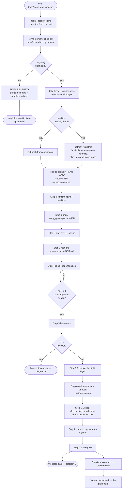
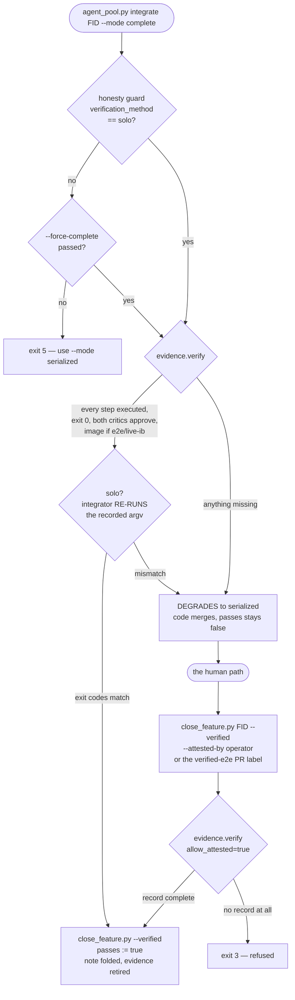
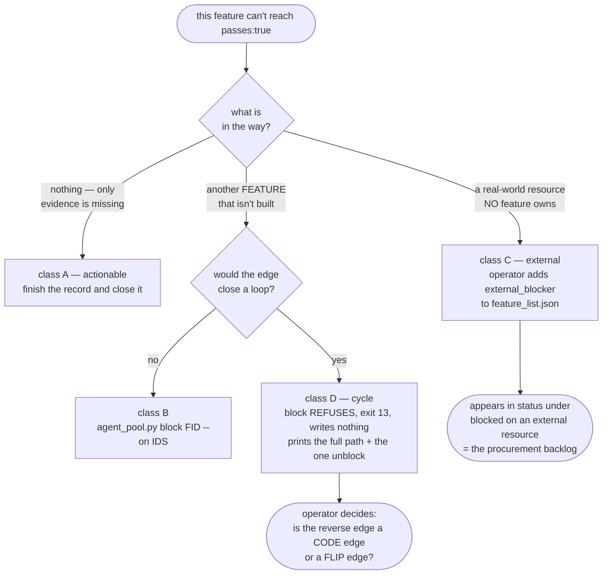
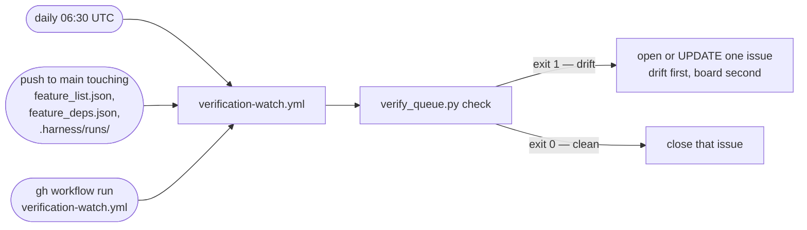

# The harness, end to end

What actually happens between "I want to work on a feature" and `passes: true`.
Companion to `docs/verification-queue.md`, which covers what to do when a feature
*can't* close.

---

## 1. The session — launcher to integrate

Steps 0–8.1 are `prompts/coding_prompt.md`; the agent reads them in order. Nothing
is skipped — every step below exists in that file.



**Step 4.1 is a hard stop.** The session starts read-only; the agent cannot edit
anything until you approve its plan.

---

## 2. The close gate — how a feature reaches `passes: true`

This is the mechanism worth understanding, because it's the one that refuses.
There are exactly **two** legitimate paths, and describing the work is neither.



Two things this diagram is drawn to make unmissable:

- **`--force-complete` only bypasses the honesty guard.** The evidence gate still
  runs and still degrades you to `serialized`. It cannot rescue a missing record —
  the old deadlock message advised exactly that, and it looped forever.
- **`--attested-by` relaxes *which* steps count, never *whether* there is a
  record.** A human vouching for the work still has to say what the work was.

---

## 3. Where a blocker goes

One word — "blocked" — used to cover four situations. Putting one in the wrong
home is what produced a bucket of eleven features no agent could claim and no
human could close.



**Never use `block --on` for class C.** A dependency edge asserts some feature owns
the blocker; if none does, the edge never clears and the feature is parked forever.
Class C today: an SMS provider account, a PTP-disciplined host, 30 real market
days, a market-hours restart on Proxmox.

---

## 4. The watch loop

Runs without you, changes nothing, and reports only what moved.



It detects what a person wouldn't notice: a feature whose last blocker just
closed, one held off the frontier by a note with nothing recording why, an
evidence record invalidated by a re-spec, and any cycle in the graph.

---

## Which command do I run?

```bash
tools/claim_and_work.sh          # auto-picks the highest-impact ready feature
tools/work_on.sh <FEATURE_ID>    # you choose — the only way onto an awaiting-verification feature
```

Both take the pool lock, allocate private ports, materialise the worktree, and
open the session in plan mode. `work_on.sh` additionally bypasses the
ready-frontier and anti-churn filters, which is why it is the operator's tool.

Before either, to see what you're walking into:

```bash
python3 tools/verify_queue.py list          # the ranked queue
python3 tools/verify_queue.py show <ID>     # the full brief for one feature
```
